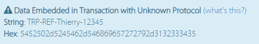

# Project BeeTeaSea: Bitcoin Transaction Building Investigations

If you like what you see, please donate some BTC to bc1qf3gsvfk0yp9fvw0k8xvq7a8dk80rqw0apcy8kx or some ETH to 0x7e674C55f954d31B2f86F69d7A58B2BCe84Cf6b4

## Resting on the shoulders of giants

I started investigating various libraries to understand the internals of Bitcoin Transaction Building.  
There are many libs available, but after a couple of weeks of looking around, the best one, well written, understandable
lib I have seen from which I shamelessly copied code from
is [https://pypi.org/project/bitcoin-utils/](https://pypi.org/project/bitcoin-utils/).  
I think the author is [Konstantinos Karasavvas](https://www.linkedin.com/in/kkarasavvas/), with also a
great [PDF](https://github.com/karask/bitcoin-textbook) I highly recommend.

This is a tutorial to learn - implementation is likely to be buggy. Teach others, teach yourself.

## Prerequisites

Have access to a local BTC node with RPC enabled (usually on port 8332).  
I used a local node for BTC testnet - local storage is about 30 GB as of Sept 2021:

```shell
bitcoind -server -rpcuser=satoshi -rpcpassword=nakamoto -rpcbind=0.0.0.0:8332 -rpcport=8332 -rpcallowip=0.0.0.0/0 -whitelist=0.0.0.0/0 -testnet -datadir=D:\btcdb
```

I also used a local database - Postgres - but this is optional: one the transactions are built, you can submit them
directly to the local node.

## SQL Script

```shell

create table neo_idx_db.neo_idx_schema.idx_account (
    id varchar primary key, -- "TJ_BTC_1"
    index serial
);

create table neo_idx_db.neo_idx_schema.idx_wallet_all (
    account varchar,
    id varchar,
    address varchar,
    change bool,
    count serial,
    used bool default false,
    kdp varchar,
    total_amount integer,
    raw jsonb,
    primary key (account, id, address),
    foreign key (account) references neo_idx_db.neo_idx_schema.idx_account(id)
);
```

## Getting fees

```shell
https://developer.bitcoin.org/reference/rpc/estimatesmartfee.html
```

# Code

Let's walk through the various python scripts:

- [addresses.py](./addresses.py) defines the various addresses types in BTC,
  namely [P2PKH](https://en.bitcoinwiki.org/wiki/Pay-to-Pubkey_Hash)
  , [P2SH](https://en.bitcoin.it/wiki/Pay_to_script_hash), [P2WPKH](https://bitcoincore.org/en/segwit_wallet_dev/)
- [btc_rpc.py](./btc_rpc.py) implements basics RPC endpoints to a bitcoin node to
  retrieve [UTXOs](https://en.wikipedia.org/wiki/Unspent_transaction_output) and broadcast a signed transaction
- [coin_selector.py](./coin_selector.py) is a very simple strategy to select the UTXOs necessary to build a transaction
  for a given amount. Much more complex algorithms can be implemented.
- [constants.py](./constants.py) defines constants used throughout the code, specifically the master seed - the one
  typically generated in a [HSM](https://en.wikipedia.org/wiki/Hardware_security_module).
- [db.py](./db.py) to manage all queries/inserts to Postgres
- [kdp.py](./kdp.py) a [key-derivation path](https://wiki.trezor.io/Standard_derivation_paths) holder
- [key_material.py](./key_material.py)
  converts [ECDSA](https://en.wikipedia.org/wiki/Elliptic_Curve_Digital_Signature_Algorithm) key-pairs
  into [Bitcoin addresses](https://cryptocurrencyfacts.com/bitcoin-address-formats/)
- [script.py](./script.py) is a minimalistic implementation of
  the [Bitcoin scripting](https://en.bitcoin.it/wiki/Script) language. I only implemented what I am using.
- [singletons.py](./singletons.py) is a module where all singletons are defined (currently only the database)
- [transactions.py](./transactions.py) defines
  the [transaction inputs and outputs](https://en.bitcoin.it/wiki/Transaction)
- [tx_signer.py](./tx_signer.py) signs the previous transaction. Usually done in
  a [HSM](https://en.wikipedia.org/wiki/Hardware_security_module).
- [wallet_helper.py](./wallet_helper.py) used by the wallet micro-service
- [wallet_service.py](./wallet_service.py) is the micro-service to create a wallet and send a transaction

# Demos

Follows are various demos of signed transactions. I will go through the first demo (P2PKH) in details - all the others
follow the same pattern.

## [P2PKH](./demos/test_p2pkh.py) sample

- Get an address and fund it via a faucet You can use the following code to get an address from scratch:

```python
km  = KeyMaterial()
wif = km.to_wif() # 'cV7Uw6gXHJV18y1f5F3CWaCX3iUn3795HHZBWbK4BbnEhrD1TET5'
adr = km.address() # 'msL7EAbrj2Bnh13bzwzLsKAjP15siQKiys'
```

- List UTXOs

[msL7EAbrj2Bnh13bzwzLsKAjP15siQKiys](https://www.blockchain.com/btc-testnet/address/msL7EAbrj2Bnh13bzwzLsKAjP15siQKiys)
is used as a "from address" - which was funded via a [bitcoin faucet](https://coinfaucet.eu/en/btc-testnet/).

We need to list the unspents for that address - using the cURL command below to your local node:

```shell
curl --user satoshi:nakamoto --data '{"jsonrpc":"2.0","method":"scantxoutset","params":["start", ["addr(msL7EAbrj2Bnh13bzwzLsKAjP15siQKiys)"]]}' http://localhost:8332 > data/msL7EAbrj2Bnh13bzwzLsKAjP15siQKiys.json
```

This call returns:

```json
{
  "result": {
    "success": true,
    "txouts": 26140974,
    "height": 2090979,
    "bestblock": "0000000000000046f7abd2f74868bc7eb7198afe88dd9b7912183f927274d8b4",
    "unspents": [
      {
        "txid": "7980a37147ebc919d2e6e69c380964f98bf2fa101d5b597d528bff504d613ab2",
        "vout": 0,
        "scriptPubKey": "76a914819464048dc9f20dcdf727fc8e9bdec88af8c3c388ac",
        "desc": "addr(msL7EAbrj2Bnh13bzwzLsKAjP15siQKiys)#qn92p7cr",
        "amount": 0.01552063,
        "height": 2090979
      }
    ],
    "total_amount": 0.01552063
  },
  "error": null,
  "id": null
}

```

The total spendable amount for that UTXO is 1552063 (sum of all 'amount' in the unspent block) satoshis.

- Update input_tx with txid 7980a37147ebc919d2e6e69c380964f98bf2fa101d5b597d528bff504d613ab2 on line 35
  in [test_p2pkh.py](./demos/test_p2pkh.py)
- Update total_amount in [test_p2pkh.py](demos/test_p2pkh.py) - this amount has to be lower than 1552063
- Note the [destination address](https://www.blockchain.com/btc-testnet/address/mzgi4XGAS75rLSPduj6otCs5ygHQX99w49)
- Execute [test_p2pkh.py](demos/test_p2pkh.py)
- Broacast the signed tx using [https://live.blockcypher.com/btc/pushtx/](https://live.blockcypher.com/btc/pushtx/)
  using Bitcoin Testnet or alternatively push it via cURL
- See
  the [result](https://live.blockcypher.com/btc-testnet/tx/5abed1619afdb71ac0058dd6abc28763c4691802a49f54c73f4559ce1deaf699/)

## [P2SH](./demos/test_p2sh.py) example

Code can be seen under folder [demos](./demos)

- Get an address and fund it via a faucet
- List UTXOs

```shell
curl --data '{"jsonrpc":"2.0","method":"scantxoutset","params":["start", ["addr(mzgi4XGAS75rLSPduj6otCs5ygHQX99w49)"]]}' http://localhost:8332
```

- Same as above
- See
  the [result](https://live.blockcypher.com/btc-testnet/tx/8d6dc6d684201ea6d505ede63c36482c410a173d31133400f73ddac14f62ff31/)

## [P2WPKH](./demos/test_from_p2wpkh.py) example (from Segwit to P2PKH)

Code can be seen under folder [demos](./demos)

- Get an address and fund it via a faucet
- List UTXOs

```shell
curl --data '{"jsonrpc":"2.0","method":"scantxoutset","params":["start", ["addr(mzgi4XGAS75rLSPduj6otCs5ygHQX99w49)"]]}' http://your-btc-node:8332
```

- See
  the [result](https://live.blockcypher.com/btc-testnet/tx/ee25841641dba335fe8d4eb62d58354301c6e28b2bc7c6802b1ef187d6662dab/)

## [P2WPKH](./demos/test_to_p2wpkh.py) example (from P2PKH to Segwit)

Code can be seen under folder [demos](./demos)

- See
  the [result](https://live.blockcypher.com/btc-testnet/tx/d2c897cdc9494791b34622671c3a8ded2d6b32a6e5e0d57562385b7839c15406/)

## [P2WPKH](./demos/test_seg_to_seg.py) example (from Segwit to Segwit)

Code can be seen under folder [demos](./demos)

- See
  the [result](https://live.blockcypher.com/btc-testnet/tx/2f141299678eec472e72afcfeb08ecb82fc4b582fc8435aed578793c79cd6ea5/)

## [P2SH with Meta Data](./demos/test_p2sh_2_in_meta.py) example

This one allows you to add metadata to a transaction, such as a travel rule reference id or any off-chain reference id.  
The transaction built can be decoded, and the decoded json part showing the metadata looks like:

```json
 {
  "addresses": null,
  "data_hex": "5452502d5245462d546869657272792d3132333435",
  "data_string": "TRP-REF-Thierry-12345",
  "script": "6a155452502d5245462d546869657272792d3132333435",
  "script_type": "null-data",
  "value": 0
}
```

You can also check out this [link](https://live.blockcypher.com/btc-testnet/tx/a4de25742c327a55641527ec4bf1495aa7c8256fb2701d8905bae38662dd2b9c/) that shows:



## Send the tx via curl

```shell
curl --user satoshi:nakamoto --data '{"jsonrpc": "1.0", "id": "curltest", "method": "sendrawtransaction", "params": ["0200000001b23a614d50ff8b527d595b1d10faf28bf96409389ce6e6d219c9eb4771a38079000000006a47304402202b6d9340ce7727457833da9cdd2618b57fc55e296ba8ed82f7a740859d1a411702201d64780b30a9652e57571c7a2042b0a7bff93345978622c687d2216dcdad9ee60121033e7f16dae1acb7c7a1b07b5722a029ebdd8b7770bd62bab2e843c9b9b512e861ffffffff0220a10700000000001976a914d242ab0bc57addff6871ad4439b3858247d17a9c88ac8fe60f00000000001976a914819464048dc9f20dcdf727fc8e9bdec88af8c3c388ac00000000"]}' -H 'content-type: text/plain;' http://localhost:8332
```

Two other useful links:

- To decode the signed
  transaction: [https://live.blockcypher.com/btc/decodetx/](https://live.blockcypher.com/btc/decodetx/)
- To broadcast the signed
  transaction: [https://live.blockcypher.com/btc/pushtx/](https://live.blockcypher.com/btc/pushtx/)

## Micro-service

I also wrote a wallet helper - that you can access via REST, locally, to help create accounts and wallets as well as
creating a transfer. See [the wallet service](./wallet_service.py)

## Coin selection

I recommend to read Mark Erhardt's Master Thesis called "An Evaluation of Coin Selection Strategies". One of the easiest
strategy would be to list the UTXOs ordered by oldest (more blocks) and increasing size. A
simple [implementation](./coin_selector.py).
